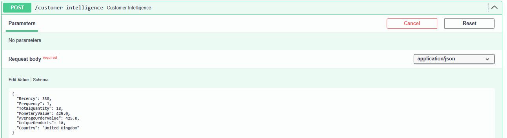
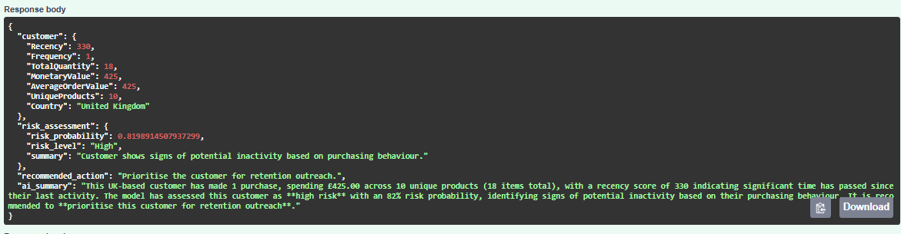

# Customer Risk Intelligence Pipeline

End-to-end machine learning and MLOps application for identifying customers at risk of becoming inactive.

## Overview

Customer Risk Intelligence Pipeline analyses historical retail transactions and produces customer-level inactivity risk assessments.

The application combines machine learning with a small generative-AI layer:

- Python and pandas process transaction data and engineer customer features.
- scikit-learn models estimate customer inactivity risk.
- FastAPI exposes predictions through an API.
- Claude via Amazon Bedrock generates business-facing customer insights.
- Docker packages the application.
- AWS ECS/Fargate provides cloud deployment.

## Demo

The API allows a business user to submit a customer's purchasing behaviour and receive an inactivity risk assessment with an AI-generated explanation and recommended retention action.

### Customer Input

Customer-level behavioural features are submitted to the API, including recency, purchase frequency, spending, average order value and product activity.



### Risk Assessment

The machine learning pipeline estimates the customer's probability of becoming inactive and converts the prediction into a risk level and recommended action. Claude, via Amazon Bedrock, generates a concise business explanation of the result.



In this example, the customer is identified as **High Risk with an 82% inactivity probability**, prompting a recommendation to prioritise the customer for retention outreach.

The API is designed as an integration layer rather than a standalone user interface. In a production environment, customer data could be processed automatically and the resulting risk assessments integrated into a CRM, retention dashboard or customer engagement workflow.

## Data

The project uses the [UCI Online Retail dataset](https://archive.ics.uci.edu/dataset/352/online+retail) containing over 500,000 transactions.

Customer features include recency, purchase frequency, monetary value, average order value and product activity.

## Modelling

Three classification models are compared:

- Logistic Regression
- Random Forest
- Gradient Boosting

Model outputs are used to generate a customer inactivity risk assessment.

## Workflow

```text id="j74m2x"
Transaction data
      ↓
Data processing
      ↓
Feature engineering
      ↓
Model prediction
      ↓
Risk assessment
      ↓
AI customer insight
      ↓
FastAPI
```

## Key considerations

- Risk represents customer inactivity rather than guaranteed churn.
- Predictions depend on historical purchasing behaviour.
- AI-generated insights explain model outputs but do not determine the underlying risk score.

## Running locally

Install the project dependencies, then run:

```bash
uvicorn customer_risk_intelligence.api:app --reload
```

## Stack

Python · pandas · scikit-learn · FastAPI · Docker · GitHub Actions · AWS · Amazon Bedrock · Claude
